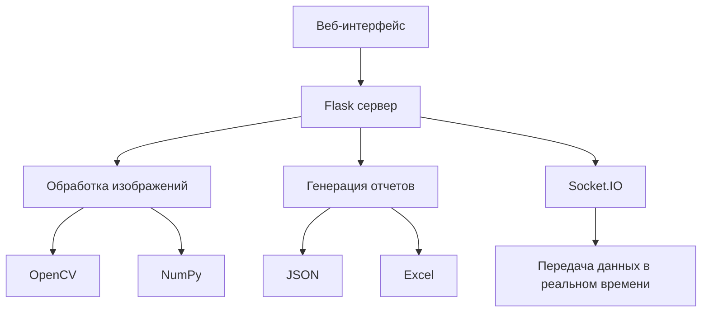

# 📝 Сканер тестов

<div align="center">


[](https://www.python.org)
[](https://opencv.org)
[](https://flask.palletsprojects.com/)
[](https://socket.io/)
[](LICENSE)

### 🔍 Современное решение для автоматизированной проверки тестов на основе компьютерного зрения

[🚀 Демо](#-демонстрация) • [📦 Установка](#-быстрый-старт) • [📖 Документация](#-документация) • [🤝 Вклад](#-участие-в-разработке)

</div>

---

## 🔗 Полезные ресурсы

- [Специальный шрифт для бланков](https://github.com/mrKamanov/TscanSDK/blob/master/assets/OMRBubbles.ttf)
- [Образец бланка для тестов](https://github.com/mrKamanov/TscanSDK/blob/master/assets/%D0%9E%D0%B1%D1%80%D0%B0%D0%B7%D0%B5%D1%86%20%D0%B1%D0%BB%D0%B0%D0%BD%D0%BA%D0%B0.docx)
- [Репозиторий проекта](https://github.com/mrKamanov/TscanSDK)

---

## ✨ Возможности

✅ **Точное распознавание** – коррекция перспективы и адаптивная обработка изображений  
⚡ **Высокая производительность** – пакетное сканирование и работа в реальном времени  
📊 **Продвинутая аналитика** – визуализация данных и экспорт отчетов  
🎨 **Современный интерфейс** – адаптивный дизайн и темная тема  

---

## 🔬 Как это работает?

### 🛠️ Алгоритм обработки

1. **Предобработка** – устранение шумов, нормализация яркости и контраста  
2. **Обнаружение бланка** – коррекция перспективных искажений  
3. **Распознавание ответов** – сегментация и анализ заполненных ячеек  
4. **Анализ результатов** – сопоставление с эталоном и формирование отчета  

### 🏗️ Используемые технологии

- **Backend:** Python, OpenCV, NumPy, Flask
- **Frontend:** HTML5, CSS3, JavaScript, Socket.IO, Chart.js
- **Хранение данных:** JSON, Excel, Base64



---

## 📸 Интерфейс

| 🔍 Распознавание | 📦 Пакетная обработка | 📊 Аналитика |
|---|---|---|
|  |  |  |

| 📝 Множественный выбор | 🛠️ Конструктор OMR листов | 📑 Инструкции |
|---|---|---|
|  |  |  |

| 📱 Мобильная версия 1 | 📱 Мобильная версия 2 | 📱 Мобильная версия 3 |
|---|---|---|
|  |  |  |

---

## 🚀 Быстрый старт

### 🛠️ Требования
- Python 3.8+
- pip
- Веб-камера (для сканирования в реальном времени)

### 📥 Установка

```bash
git clone https://github.com/mrKamanov/TscanSDK.git
cd TscanSDK
python -m venv venv
source venv/bin/activate  # Linux/macOS
venv\Scripts\activate     # Windows
pip install -r requirements.txt
python app.py
```

---

## 📖 Документация

### 🎥 Работа с камерой
- 🟢 **Включить** – запуск видеопотока
- 🔴 **Выключить** – остановка записи
- ⏸️ **Стоп-кадр** – фиксация изображения
- ➕ **Сохранить** – добавление результата в отчет

### 📦 Пакетная обработка
1. 📤 Загрузите изображения (drag & drop или выбор файлов)
2. ⚙️ Настройте параметры теста
3. ▶️ Запустите распознавание
4. 📋 Проверьте результаты
5. 💾 Экспортируйте отчет

---

## 🤝 Участие в разработке

Мы приветствуем вклад в развитие проекта!

1. 🍴 Форкните репозиторий
2. 🔧 Создайте ветку для новой функции
3. 📝 Внесите изменения
4. 🔍 Протестируйте
5. 📫 Создайте Pull Request

---
### Сделано с ❤️ для образования

## 👥 Контакты

📧 **mr.kamanov@yandex.ru**

<div align="center">

### 🚀 Поддержите проект! ⭐

[](https://github.com/mrKamanov)
[](https://github.com/mrKamanov/TscanSDK)

</div>

