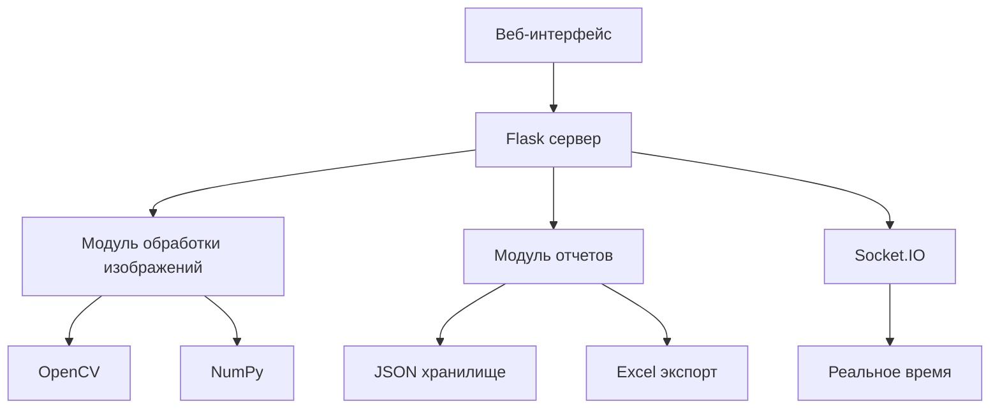

# 📝 TscanSDK

<div align="center">


[](https://www.python.org)
[](https://opencv.org)
[](https://flask.palletsprojects.com/)
[](https://socket.io/)
[](LICENSE)

**Современное решение для автоматизированной проверки тестов с использованием компьютерного зрения и искусственного интеллекта**

[Демо](#демонстрация) • [Установка](#🚀-быстрый-старт) • [Документация](#📖-документация) • [Вклад](#💡-участие-в-разработке)

</div>

## ✨ Ключевые особенности

🎯 **Точное распознавание**
- Продвинутые алгоритмы компьютерного зрения
- Автоматическая коррекция перспективы
- Адаптивная обработка изображений

🚀 **Высокая производительность**
- Обработка в реальном времени
- Пакетное сканирование
- Оптимизированные алгоритмы

📊 **Продвинутая аналитика**
- Детальная статистика
- Визуализация данных
- Экспорт в Excel

🎨 **Современный интерфейс**
- Адаптивный дизайн
- Интуитивное управление
- Темная тема

## 🔬 Принцип работы

### Алгоритм распознавания

Test Vision AI использует многоступенчатый алгоритм обработки изображений для точного распознавания ответов:

1. **Предварительная обработка**
   - Адаптивная коррекция яркости и контраста
   - Устранение шумов и артефактов
   - Нормализация размера изображения

2. **Определение области ответов**
   - Детекция границ бланка
   - Коррекция перспективных искажений
   - Выделение области с ответами

3. **Сегментация ответов**
   - Разбиение на индивидуальные ячейки
   - Анализ заполненности каждой ячейки
   - Определение отмеченных вариантов

4. **Анализ результатов**
   - Сопоставление с правильными ответами
   - Подсчет баллов и статистики
   - Формирование отчета

### Технологии и библиотеки

🔧 **Backend**
- **Python** - основной язык разработки
- **OpenCV** - компьютерное зрение и обработка изображений
- **NumPy** - математические вычисления и работа с массивами
- **Flask** - веб-сервер и API

🎨 **Frontend**
- **HTML5/CSS3** - современная верстка
- **JavaScript** - интерактивность интерфейса
- **Socket.IO** - обмен данными в реальном времени
- **Chart.js** - визуализация данных

💾 **Хранение данных**
- **JSON** - формат хранения результатов
- **Excel** - экспорт отчетов
- **Base64** - кодирование изображений

### Архитектура приложения


```mermaid
graph TD
    A[Веб-интерфейс] --> B[Flask сервер]
    B --> C[Модуль обработки изображений]
    C --> D[OpenCV]
    C --> E[NumPy]
    B --> F[Модуль отчетов]
    F --> G[JSON хранилище]
    F --> H[Excel экспорт]
    B --> I[Socket.IO]
    I --> J[Реальное время]
```

### Преимущества подхода

✨ **Точность**
- Продвинутые алгоритмы компьютерного зрения
- Автоматическая адаптация к условиям съемки
- Устойчивость к различным типам бланков

⚡ **Производительность**
- Оптимизированные алгоритмы обработки
- Эффективное использование ресурсов
- Быстрый отклик системы

🛡️ **Надежность**
- Проверка корректности данных
- Обработка ошибок и исключений
- Сохранение результатов

## 🌟 Демонстрация

<div align="center">

### Сканирование в реальном времени


### Пакетная обработка


### Аналитика и отчеты


</div>

## 🚀 Быстрый старт

### Предварительные требования

- Python 3.8+
- pip
- Веб-камера (для сканирования в реальном времени)

### Установка

1. **Клонируйте репозиторий**
```bash
git clone https://github.com/mrKamanov/TscanSDK.git
cd TscanSDK
```

2. **Создайте виртуальное окружение**
```bash
python -m venv venv
source venv/bin/activate  # Linux/macOS
venv\Scripts\activate     # Windows
```

3. **Установите зависимости**
```bash
pip install -r requirements.txt
```

4. **Запустите приложение**
```bash
python app.py
```

## 📖 Документация

### 🎥 Сканирование в реальном времени

Мощный инструмент для мгновенной проверки тестов через камеру устройства.

#### Управление камерой
- 🟢 **Включить камеру** - Запуск видеопотока
- 🔴 **Выключить камеру** - Остановка записи
- ⏸️ **Стоп-кадр** - Фиксация изображения
- ➕ **Добавить в отчет** - Сохранение результатов

#### Настройка изображения
- 🔆 **Яркость** - Регулировка освещенности
- 🎨 **Контраст** - Настройка четкости
- 🎯 **Резкость** - Улучшение детализации
- 🌈 **Насыщенность** - Корректировка цветов

### 📦 Пакетная обработка

Эффективное решение для проверки большого количества тестов.

#### Процесс работы
1. 📤 Загрузка изображений (drag & drop или выбор файлов)
2. ⚙️ Настройка параметров теста
3. ▶️ Запуск обработки
4. 📋 Просмотр результатов
5. 💾 Сохранение в отчет

### 📊 Аналитика и отчеты

Продвинутые инструменты анализа результатов.

#### Возможности
- 📈 Графики успеваемости
- 📉 Статистика ошибок
- 📊 Распределение оценок
- 📑 Экспорт в Excel

### 📝 Требования к бланкам

#### Оптимальные условия
- 📏 Четкие границы области ответов
- 🖼️ Высокий контраст изображения
- ✒️ Темные отметки ответов
- 💡 Хорошее освещение
- 📐 Правильный угол съемки

## 💡 Участие в разработке

Мы приветствуем вклад в развитие проекта! 

1. 🍴 Форкните репозиторий
2. 🔧 Создайте ветку для новой функции
3. 📝 Внесите изменения
4. 🔍 Протестируйте
5. 📫 Создайте Pull Request

## 📄 Лицензия

Проект распространяется под лицензией MIT. Подробности в файле [LICENSE](LICENSE).

## 👥 Команда

- 📧 **Контакты**: mr.kamanov@yandex.ru

## 🏫 Организация

**МБОУ СОШ №14**

---

<div align="center">

### Сделано с ❤️ для образования

[](https://github.com/mrKamanov)
[](https://github.com/mrKamanov/TscanSDK)

</div>

## Возможности

- Сканирование тестов в реальном времени через веб-камеру
- Пакетная обработка сканированных тестов
- Формирование отчётов и статистики
- Настраиваемые критерии оценивания
- Удобный веб-интерфейс

## Технологии

- Python 3.x
- Flask
- OpenCV
- Socket.IO
- HTML5/CSS3
- JavaScript

## Ресурсы

- [Специальный шрифт для бланков](https://github.com/mrKamanov/TscanSDK/blob/master/assets/OMRBubbles.ttf)
- [Образец бланка для тестов](https://github.com/mrKamanov/TscanSDK/blob/master/assets/Образец%20бланка.docx)
- [Репозиторий проекта](https://github.com/mrKamanov/TscanSDK)

## Принцип работы

Система использует компьютерное зрение для распознавания и анализа заполненных тестовых форм. Алгоритм включает:

1. Обнаружение области с ответами
2. Сегментация ответов
3. Анализ заполненных областей
4. Сравнение с правильными ответами
5. Формирование результатов

## Лицензия

MIT

## Автор

[mrKamanov](https://github.com/mrKamanov) 